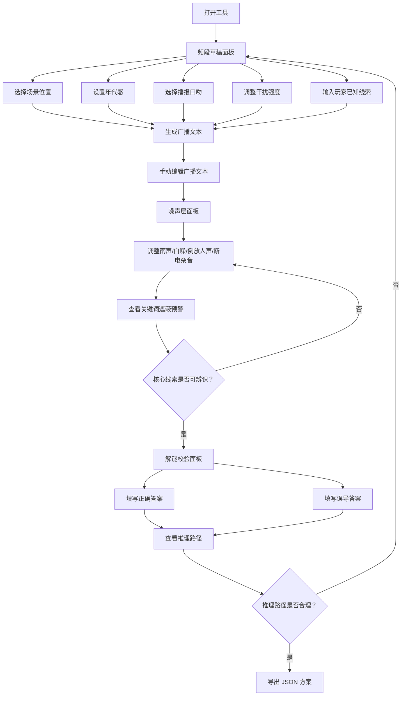

## 1. 产品概述

电台谜题编排器是一款面向独立恐怖游戏音频策划的桌面端创作工具，将"听不清、听错、听懂一半"的模糊听觉体验转化为可控的关卡素材。工具帮助策划快速编排广播谜题——从频段草拟、噪声遮蔽到解谜校验——并导出可试听、可评审的方案文件给编剧和关卡设计师。

- 目标用户：独立恐怖游戏音频策划、叙事设计师
- 核心价值：将模糊听觉体验从"不可控的随机感"变为"可设计、可校验、可迭代"的关卡素材

## 2. 核心功能

### 2.1 功能模块

1. **频段草稿**：选择场景位置、年代感、播报口吻和干扰强度，输入玩家已知线索，生成数段短广播文本
2. **噪声层**：拖动雨声、白噪、倒放人声、断电杂音等噪声滑块，系统即时提示哪些关键词可能被遮住
3. **解谜校验**：填写正确答案和误导答案，工具按玩家可能听到的片段列出推理路径
4. **导出评审**：将完整谜题方案导出为 JSON 文件，供编剧和关卡设计师评审

### 2.2 页面详情

| 页面名称 | 模块名称 | 功能描述 |
|----------|----------|----------|
| 主工作台 | 顶部导航栏 | 三个面板切换（频段草稿 / 噪声层 / 解谜校验），项目名称编辑，导出按钮 |
| 频段草稿面板 | 场景位置选择器 | 预设场景（废弃医院、深夜公路、地下台站等）+ 自定义输入 |
| 频段草稿面板 | 年代感选择器 | 1960s-2020s年代滑块，影响广播文本用词和语气 |
| 频段草稿面板 | 播报口吻选择器 | 选项：官方通告、私人遗言、紧急求救、机械循环、宗教仪式 |
| 频段草稿面板 | 干扰强度控制 | 1-5级干扰强度选择，影响生成文本的断裂程度 |
| 频段草稿面板 | 玩家已知线索输入 | 文本框，输入玩家在进入谜题前已掌握的信息 |
| 频段草稿面板 | 广播文本生成区 | 一键生成2-5段短广播文本，支持手动编辑 |
| 噪声层面板 | 噪声通道滑块组 | 雨声、白噪、倒放人声、断电杂音四个独立滑块（0-100%） |
| 噪声层面板 | 关键词遮蔽预警区 | 实时标注被当前噪声组合可能遮蔽的关键词，红/黄/绿三级预警 |
| 噪声层面板 | 模拟试听区 | 播放带噪声叠加的广播文本（文字模拟），展示玩家实际听到效果 |
| 解谜校验面板 | 正确答案输入区 | 填写谜题的正确答案及对应线索链 |
| 解谜校验面板 | 误导答案输入区 | 填写可能误导玩家的错误推理方向 |
| 解谜校验面板 | 推理路径图 | 按玩家可听片段自动列出可能的推理路径树 |
| 导出功能 | 导出按钮 | 将三个面板的全部配置和内容导出为 JSON 文件 |

## 3. 核心流程

用户打开工具后，依次在三个面板中完成谜题编排：

1. 在"频段草稿"中选择场景参数并输入线索，生成广播文本
2. 切换到"噪声层"，调整各噪声通道强度，查看关键词遮蔽预警，确保核心线索可被辨识
3. 切换到"解谜校验"，填写正确与误导答案，检视推理路径是否合理
4. 点击导出，生成 JSON 方案文件供团队评审

## 4. 用户界面设计

### 4.1 设计风格

- **主色调**：深黑底（#0A0A0F）搭配琥珀色（#D4A04A）作为主强调色，暗红（#8B2035）作为危险/预警色，冷灰绿（#4A6741）作为安全色
- **按钮风格**：圆角极小（2px），拟物化工业按钮质感，带微弱内发光
- **字体**：标题使用 Share Tech Mono（等宽工业感），正文使用 Noto Sans SC
- **布局风格**：三面板纵向堆叠/横向切换，左侧固定侧栏显示项目大纲，右侧主工作区
- **图标风格**：线条图标（lucide-react），细线风格
- **背景纹理**：全局覆盖微弱噪点纹理和CRT扫描线效果，营造老旧电子设备氛围
- **动效**：面板切换时的信号闪烁过渡，滑块拖动时的静电干扰微动，关键词被遮蔽时的红色脉冲

### 4.2 页面设计概览

| 页面名称 | 模块名称 | UI元素 |
|----------|----------|--------|
| 主工作台 | 顶部导航栏 | 深色工具栏，三tab切换带信号强度指示器动画，项目名可编辑，右侧导出按钮 |
| 频段草稿 | 场景位置选择器 | 卡片网格，每个场景一张暗色卡片配图标，选中边框琥珀色发光 |
| 频段草稿 | 年代感/口吻/干扰 | 紧凑表单布局，滑块+标签，下拉选择器 |
| 频段草稿 | 广播文本生成区 | 终端风格文本框，等宽字体，绿色闪烁光标，生成按钮带静电效果 |
| 噪声层 | 噪声通道滑块组 | 四个垂直滑块并排，每个带波形指示器，拖动时波形动态变化 |
| 噪声层 | 关键词遮蔽预警 | 广播文本叠加显示，被遮蔽关键词标红+删除线，可辨识关键词标绿 |
| 噪声层 | 模拟试听区 | 终端输出风格，逐步显示带噪声的文本，模糊字符用 █ 替代 |
| 解谜校验 | 答案输入区 | 简洁表单，正确答案绿色标签，误导答案红色标签 |
| 解谜校验 | 推理路径图 | 树状图，节点为可听片段，连线标注推理步骤，正确路径实线绿色，误导路径虚线红色 |

### 4.3 响应式设计

- 桌面端优先设计，最小支持 1280px 宽度
- 面板可横向展开或纵向堆叠适配不同屏幕

### 4.4 导出格式

导出 JSON 包含：项目名称、场景配置、广播文本、噪声层参数、关键词遮蔽状态、正确答案、误导答案、推理路径树
