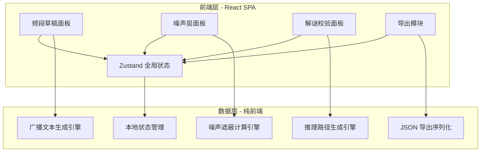
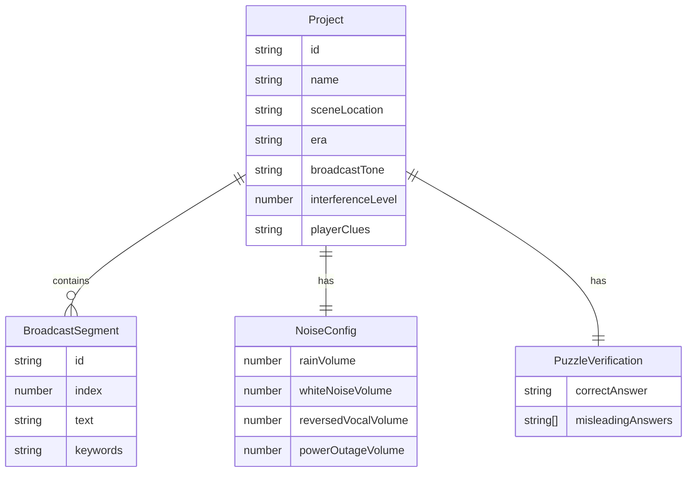

## 1. 架构设计



## 2. 技术说明

- **前端**：React@18 + TypeScript + Tailwind CSS@3 + Vite
- **初始化工具**：vite-init（react-ts 模板）
- **后端**：无（纯前端应用，所有逻辑在浏览器端完成）
- **数据库**：无（使用 Zustand 管理内存状态，导出为 JSON 文件）
- **状态管理**：Zustand
- **路由**：React Router DOM（单页面内面板切换，无需多路由）

## 3. 路由定义

| 路由 | 用途 |
|------|------|
| / | 主工作台，包含三个面板切换 |

## 4. 核心引擎设计

### 4.1 广播文本生成引擎

根据场景位置、年代感、播报口吻、干扰强度和玩家已知线索，生成2-5段短广播文本。

- 场景位置映射关键词库（如"废弃医院"→ 病房、走廊、手术室、地下室等）
- 年代感映射用词风格（1960s→文言感重、2020s→现代简洁）
- 播报口吻映射句式模板（官方通告→正式通告体、私人遗言→口语独白体）
- 干扰强度映射文本断裂程度（1级→完整句子、5级→碎片化短词）
- 玩家已知线索用于在生成文本中埋入对应的可辨识片段

### 4.2 噪声遮蔽计算引擎

根据四通道噪声强度（雨声、白噪、倒放人声、断电杂音），计算广播文本中每个关键词的被遮蔽概率。

- 每个噪声通道对不同频段特征的关键词有不同遮蔽权重
- 雨声：遮蔽低频环境词（方位、天气类）
- 白噪：均匀遮蔽所有关键词，概率与强度线性相关
- 倒放人声：遮蔽情感词和语气词
- 断电杂音：随机遮蔽，倾向于遮蔽句子开头和结尾
- 综合遮蔽概率 = 1 - Π(1 - 各通道遮蔽概率)
- 预警级别：>70% 红色（高度遮蔽）、30-70% 黄色（部分遮蔽）、<30% 绿色（可辨识）

### 4.3 推理路径生成引擎

根据玩家可听片段（未被遮蔽的关键词）、正确答案和误导答案，生成推理路径树。

- 从可听片段出发，列出可能的推理方向
- 标注哪些路径导向正确答案（绿色实线）
- 标注哪些路径导向误导答案（红色虚线）
- 计算每条路径的"推理难度"（所需推理步骤数量）

## 5. 数据模型

### 5.1 数据模型定义



### 5.2 Zustand Store 结构

```typescript
interface ProjectStore {
  projectName: string
  sceneLocation: string
  era: string
  broadcastTone: string
  interferenceLevel: number
  playerClues: string
  segments: BroadcastSegment[]
  noiseConfig: NoiseConfig
  correctAnswer: string
  misleadingAnswers: string[]
  activePanel: 'draft' | 'noise' | 'verify'
  
  setProjectName: (name: string) => void
  setSceneLocation: (location: string) => void
  setEra: (era: string) => void
  setBroadcastTone: (tone: string) => void
  setInterferenceLevel: (level: number) => void
  setPlayerClues: (clues: string) => void
  generateSegments: () => void
  updateSegment: (id: string, text: string) => void
  setNoiseConfig: (config: Partial<NoiseConfig>) => void
  setCorrectAnswer: (answer: string) => void
  addMisleadingAnswer: (answer: string) => void
  removeMisleadingAnswer: (index: number) => void
  setActivePanel: (panel: 'draft' | 'noise' | 'verify') => void
  exportProject: () => object
}
```
